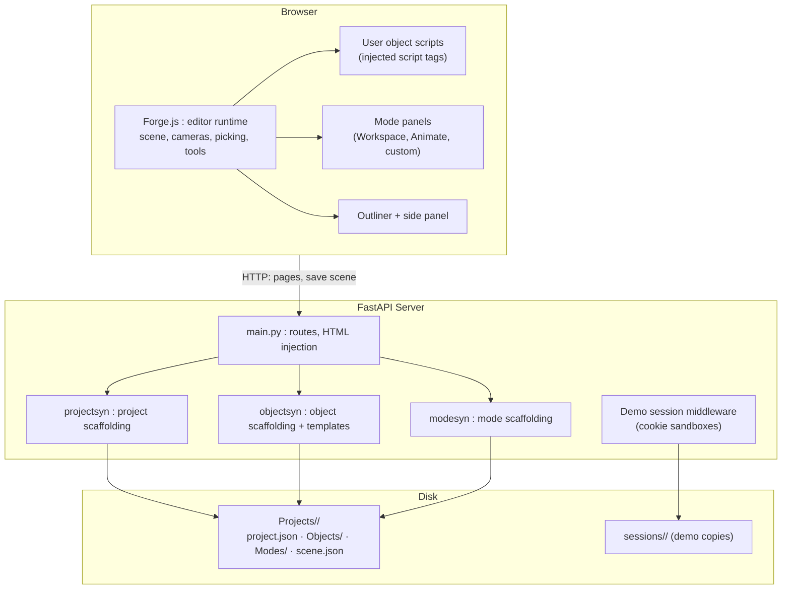
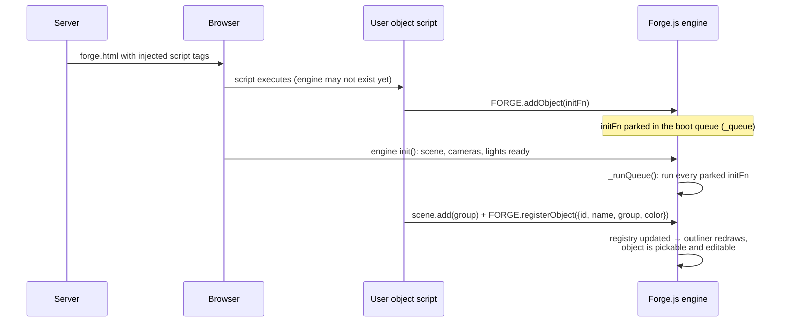

# FORGE3D : Full Technical Write-Up
## A Browser 3D Editor Built From Scratch

**Version:** 1.0
**Author:** Ahmed Nassem
**Date:** September 2026

---

## Table of Contents

1. [Overview](#1-overview)
2. [System Architecture](#2-system-architecture)
3. [Projects on Disk](#3-projects-on-disk)
4. [The Object-Script Pipeline](#4-the-object-script-pipeline)
5. [The Editor Runtime (Forge.js)](#5-the-editor-runtime-forgejs)
6. [The Modes System](#6-the-modes-system)
7. [Scene Persistence & Animation](#7-scene-persistence--animation)
8. [Demo Sandboxing](#8-demo-sandboxing)
9. [Design Decisions](#9-design-decisions)
10. [Honest Limits](#10-honest-limits)
11. [Future Work](#11-future-work)

---

## 1. Overview

FORGE3D is a small 3D workspace editor that runs entirely in the browser, with no editor framework behind it. The only borrowed piece is Three.js (vendored r150) for rendering math. The FastAPI backend owns project files on disk; the browser-side runtime, **Forge.js**, is the editor: scene management, selection, transform tools, cameras, panels, and animation.

The core idea: **scene objects are real JavaScript files the user writes.** You don't insert a mesh from a menu; you create an *Object*, the server scaffolds a script file, and your code builds the geometry and registers it with the engine. Anything Three.js can construct becomes a selectable, editable editor object.

> **Note on screenshots:** the live demo at [ahmednassem.com/projects/forge3d](https://ahmednassem.com/projects/forge3d/) is the best way to see the editor in action. Screenshots and short clips will be added to this document in a future revision.

---

## 2. System Architecture



When a project opens, the server renders `templates/forge.html` and replaces two placeholders (`<!-- __OBJECTS__ -->` and `<!-- __MODES__ -->`) with script tags for every object and mode file in the project folder. The editor is assembled per project, from the user's own files.

---

## 3. Projects on Disk

A project is a folder, not a database row:

```
Projects/<name>/
  project.json        : manifest: { name, id, created, modes: ["Workspace"] }
  Objects/            : user-written object scripts (*.js)
  Modes/<Mode>/       : mode.js, index.html, style.css per custom mode
  shared/             : assets shared across the project
  scene.json          : saved transforms/colors/keyframes (written on save)
```

`projectsyn.create_project` scaffolds all of it, including a default Workspace mode. `objectsyn.create_object` scaffolds new object scripts from templates (`PRIMITIVE_TEMPLATE` for built-in primitive shapes, `OBJECT_TEMPLATE` for free-form code); upload and delete round out the lifecycle. Because everything is plain files, a project is trivially copyable, which the demo sandboxing (§8) exploits directly.

---

## 4. The Object-Script Pipeline

The hardest problem in the codebase: user scripts arrive as plain `<script>` tags and may execute **before the engine exists**. The pipeline that solves it:



A user script is an IIFE that builds a `THREE.Group`, wraps its setup in `FORGE.addObject(scene => ...)`, and calls `FORGE.registerObject(...)` inside. The registry (an in-memory list of `{ id, name, group, color, visible }`) is the editor's spine: the outliner renders from it, picking resolves to it, and transforms apply through it. The sample projects prove the point: a drivable car and a working Rubik's cube are just object scripts.

---

## 5. The Editor Runtime (Forge.js)

### 5.1 Picking

Clicking the viewport raycasts (`THREE.Raycaster`) into whatever mesh hierarchy user scripts happened to build. A hit on any child mesh **walks up the parent chain** until it reaches a registered group, so selection works on nested structures the engine has never seen before. Shift/Ctrl extends the selection; selected objects get `THREE.BoxHelper` outlines.

### 5.2 Transform tools

Editing follows Blender's grammar: **G / R / S** (grab, rotate, scale) with X/Y/Z axis locks, implemented as ray–plane intersections so dragging feels anchored to the world, not the screen. Every tool captures a baseline snapshot of the selection when it starts; confirm commits, and cancel (right-click / Esc) restores the exact prior state, multi-object edits included. The side panel offers numeric transform/rotation/scale editing against the same baselines, plus duplicate and focus.

### 5.3 Cameras and viewport

Dual cameras (perspective and orthographic) behind one orbit model (`sph = {theta, phi, r}`): drag to orbit, wheel to zoom, FOV control, front/top/right/isometric view presets, and an SVG orientation gizmo in the corner that stays in sync with the camera. Grid and axis overlays, wireframe and shadow toggles, background color, and ambient/sun lighting sliders round out the workspace.

---

## 6. The Modes System

A mode is a UI tab the project ships alongside the 3D view. `FORGE.registerMode({ id, name, panel, onEnter, onExit, viewport })` covers three kinds:

| Mode kind | UI source | Example |
|---|---|---|
| Built-in panel | Inline HTML string injected into the side panel | Workspace (cameras, presets, overlays) |
| Built-in viewport mode | Registered by the engine itself | Animate (keyframe capture + playback) |
| Custom project mode | `onEnter` fetches the mode's own `index.html` + CSS into the content area | RubikCube project's cube/robot consoles |

Custom modes mean a project isn't just geometry: it ships its own tooling. Tabs are rebuilt from registered modes and can be drag-reordered; `viewport: true` keeps the 3D view visible inside a mode.

---

## 7. Scene Persistence & Animation

`saveScene()` posts the scene to the server (`POST /api/{project}/scene`, size-capped), which writes `scene.json`:

- `objects[]`: per registered object, `id`, `color`, position `p[3]`, rotation `r[3]`, scale `s[3]`
- `keyframes[]`: labeled snapshots, per object `{ id, p, q, s }` (position, quaternion, scale)
- `segDuration`: playback timing between keyframes

On load, `_loadScene()` fetches the file if present and re-applies transforms, colors, and keyframes on top of whatever the object scripts constructed. The Animate mode's `captureKeyframe` records the live scene as a keyframe; playback interpolates between them. Code stays the source of geometry; `scene.json` is the layer of *edits on top of code*.

---

## 8. Demo Sandboxing

Projects are folders and the editor creates and deletes files, so a public demo of that is dangerous. Demo mode (`FORGE_DEMO=1`) makes it safe:

| Step | Mechanism |
|---|---|
| Identity | `forge_sid` cookie (32-hex, validated), `httponly`, `samesite=lax` |
| Provision | First request: `shutil.copytree` of the sample projects into `sessions/<sid>/` |
| Isolation | All project + static paths resolve inside the visitor's session dir, with path-traversal checks |
| Liveness | Session dir `utime` touched on every request |
| Cleanup | Background sweeper every 15 min deletes sessions idle > 6 hours |
| Cap | Max 500 sessions; oldest evicted first |
| Guard rails | Sample projects (`rubikcube`, `carv1`) cannot be deleted |

Two visitors can never see each other's edits, and an abandoned sandbox cleans itself up. Covered by an end-to-end test (`test_e2e.py`).

---

## 9. Design Decisions

| # | Decision | Alternative | Rationale |
|---|---|---|---|
| D1 | Objects are user-written script files | Menu-inserted primitives in a scene DB | Anything Three.js can build becomes an editor object with zero engine changes; the editor grows with its user |
| D2 | Boot queue for script registration | Strict load ordering | Script tags execute whenever they execute; parking init functions makes order irrelevant |
| D3 | Parent-walk picking to the registered group | Pickable-mesh whitelist | User hierarchies are arbitrary; resolving to the owning registered object keeps selection semantic |
| D4 | Modes fetch their own HTML/CSS | One fixed panel layout | A project can ship real tooling (the Rubik's cube console) without touching the engine |
| D5 | Copy-per-session demo sandboxes | Shared demo project or read-only mode | The whole point is *editing*; file-level isolation lets strangers safely have the real thing |
| D6 | `scene.json` stores edits, scripts stay source of truth | Serialize the full scene graph | Code-defined geometry can't round-trip through JSON without losing the code; persisting deltas keeps both |

---

## 10. Honest Limits

- **No undo/redo**: the transform tools keep baseline snapshots for cancel, but there is no general command stack.
- **No large-scene performance work**: no instancing, batching, or LOD; scenes are ordinary per-script meshes.
- **The WebSocket endpoint is an echo stub**: no real-time collaboration yet.
- Per-mesh keyframe detail doesn't survive a reload; saved keyframes are group-level.

---

## 11. Future Work

- Generalize the tool baselines into a proper undo/redo command stack, the most-missed feature in real use.
- Deepen `scene.json` so per-mesh animation data survives reloads.
- Replace the WS stub with per-project rooms broadcasting registry changes, the path to a multi-user editor.
- Instancing and draw-call budgeting for large scenes.

---

*End of write-up.*
